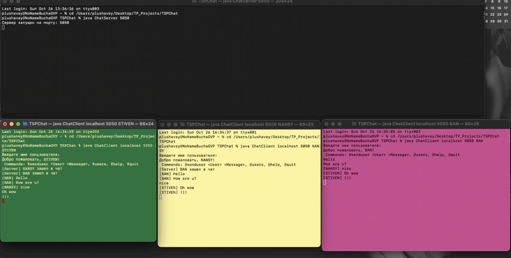

# TSP Chat

## Многопользовательский чат

## О чем работа
В этой лабораторной работе реализован текстовый многопользовательский чат. 
Все пользователи подключаются к одному серверу, а сервер пересылает сообщения между клиентами. Программа работает по протоколу TCP.

## Что сделал
Я написал сервер, который принимает подключения от нескольких клиентов и пересылает сообщения. 
Реализовал отправку сообщений всем участникам чата и отправку личного сообщения конкретному пользователю через команду @senduser. 
Также сделал обработку подключения пользователей и обмен текстовыми сообщениями в реальном времени.

## Как работает
Сначала запускается сервер. После этого несколько клиентов подключаются к нему. 
Пользователь вводит сообщения в консоль. Если сообщение обычное, оно отправляется всем участникам чата. 
Если используется команда @senduser, сообщение получает только выбранный пользователь. 
Сервер постоянно принимает сообщения от клиентов и пересылает их нужным получателям.
