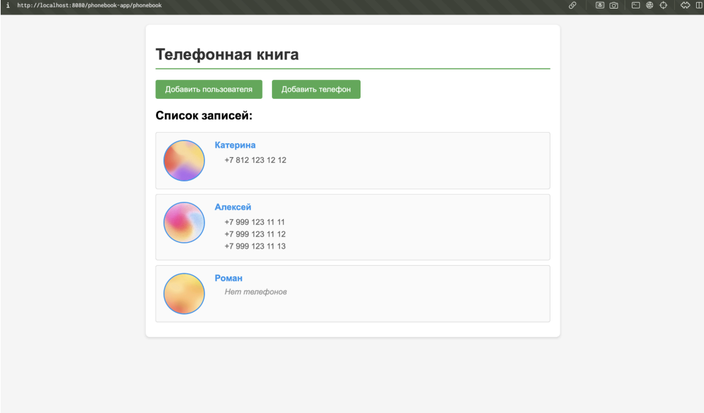

# Phonebook App

## Сервлет для записной книжки

## О чем работа

В этой лабораторной работе реализован сервлет для работы с записной книжкой. 
Для каждого человека хранится имя и один или несколько телефонов. 
При запуске данные загружаются из текстового файла.

## Что сделал

Я реализовал сервлет, который загружает данные записной книжки из файла. 
Сделал просмотр списка записей, добавление нового пользователя и добавление нового телефона для уже существующего пользователя. 
Также сделал отдельные страницы с формами для ввода данных через обычные поля input и кнопку submit.

## Как работает

При запуске сервлет считывает данные из текстового файла и формирует записную книжку. 
На главной странице отображается список всех записей и ссылки для перехода к формам добавления. 
Пользователь может открыть нужную страницу, ввести данные в форму и отправить их на сервер. 
После этого информация обновляется и снова показывается в общем списке.
