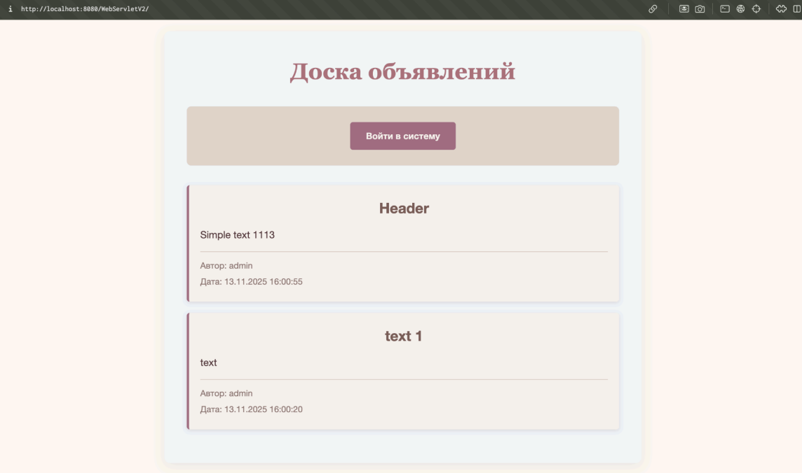

# Announcement service

## Доска объявлений на сервлетах

## О чем работа

В этой лабораторной работе реализована простая доска объявлений. 
Объявление содержит заголовок, текст, имя пользователя и время размещения. 
Просматривать объявления можно без входа в систему, а добавлять объявления может только авторизованный пользователь.

## Что сделал

Я реализовал аутентификацию пользователей через HttpSession. 
При старте программы загрузил логины и пароли из текстового файла. 
Сделал главную страницу со списком объявлений, страницу входа, добавление нового объявления и выход из системы. 
Также подключил отдельный файл style.css и сделал оформление страницы через CSS.

## Как работает

Сначала пользователь открывает главную страницу и видит список объявлений. 
Если он не вошел в систему, ему доступна только ссылка на вход. 
После успешной авторизации через логин и пароль в сессии сохраняется информация о пользователе, и появляются дополнительные ссылки для выхода и добавления объявления. Объявления можно смотреть всем, а создавать только после входа. 
Если очистить cookie в браузере, пользователь выходит из системы, потому что сессия теряется.
