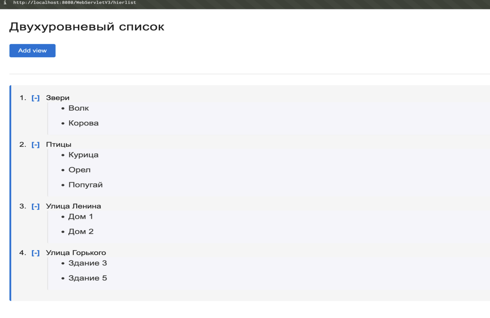

# Двухуровневый список с JavaScript

## Двухуровневый список с JavaScript

## О чем работа

В этой лабораторной работе реализован сервлет, который показывает двухуровневый список. 
Данные загружаются из текстового файла на сервере. 
Для удобной работы со списком используется JavaScript.

## Что сделал

Я реализовал загрузку списка из текстового файла и вывод его на страницу в виде HTML. 
Сделал нумерованный список верхнего уровня и вложенные элементы второго уровня. 
С помощью JavaScript добавил возможность скрывать и показывать вложенные элементы по нажатию на символ плюс или минус. 
При этом запросы на сервер не отправляются.

## Как работает

При запуске сервлет считывает текстовый файл и формирует структуру списка. 
На странице пользователь видит элементы верхнего уровня. 
Рядом с каждым из них есть кнопка для раскрытия или скрытия вложенного списка. 
Когда пользователь нажимает на плюс, JavaScript показывает элементы второго уровня. 
Когда нажимает на минус, вложенный список скрывается. Вся работа по раскрытию и скрытию происходит прямо в браузере.
